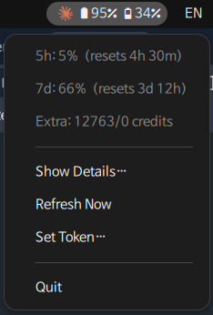

# ⚡ Claude AI Usage Widget — Linux Taskbar

A lightweight system tray widget that shows your Claude AI subscription usage percentage (5-hour and 7-day rate limit windows) directly in your Linux taskbar.


<!-- Add a screenshot.png to the repository showing the widget in action -->

## Quick Start

```bash
# Install dependencies
sudo apt install python3 python3-gi python3-gi-cairo gir1.2-appindicator3-0.1 gir1.2-notify-0.7

# Install widget
git clone https://github.com/StaticB1/claude_ai_usage_widget.git && cd claude_ai_usage_widget
chmod +x install.sh && ./install.sh

# Start widget
claude-widget-start
```

## Features

- **Taskbar percentage** — shows your 5h usage % at a glance with color-coded icon
- **Click for details** — popup with 5h + 7d utilization, progress bars, reset timers, and subscription plan
- **Extra usage tracking** — displays pay-as-you-go monthly credit usage if enabled on your account
- **Threshold notifications** — desktop alerts at startup, 75%, 90%, and 100% usage
- **Auto-refresh** — polls every 2 minutes (configurable)
- **Auto-detect credentials** — reads Claude Code's `~/.claude/.credentials.json` on Linux
- **Manual token entry** — dialog for manual OAuth token if you don't use Claude Code
- **Autostart** — installs a `.desktop` entry for autostart on login

## Requirements

- Linux with GTK3 (GNOME, KDE, XFCE, etc.)
- Python 3.10+
- System packages:
  ```
  sudo apt install python3 python3-gi gir1.2-appindicator3-0.1 gir1.2-notify-0.7
  ```

## Install

```bash
git clone https://github.com/StaticB1/claude_ai_usage_widget.git && cd claude_ai_usage_widget
chmod +x install.sh
./install.sh
```

Then run:
```bash
claude-widget-start
```

It will autostart on next login.

## Usage

```bash
claude-widget-start   # Start the widget
claude-widget-stop    # Stop the widget
```

The widget runs in the background and displays in your system tray.

**Check if running:**
```bash
ps aux | grep '[c]laude_usage_widget'
```

## Getting Your OAuth Token

### Option A: Claude Code (automatic — recommended)

If you have [Claude Code](https://code.claude.com) installed and signed in at least once:

```bash
claude   # or any `claude auth login` if you haven't signed in before
```

The widget reads `~/.claude/.credentials.json` and **automatically refreshes the access token on your behalf** whenever it expires — you do **not** need to re-run `claude` after every reboot. The widget uses the same `client_id` and refresh endpoint (`https://platform.claude.com/v1/oauth/token`) that Claude Code uses internally.

If the refresh token itself has expired (rare — happens after very long inactivity), the widget pops a desktop notification asking you to run `claude` once to re-authenticate.

### Option B: Browser DevTools (manual fallback)

1. Open https://claude.ai and log in
2. Open DevTools → **Network** tab
3. Send a message, then filter requests for `api.anthropic.com`
4. Find the `Authorization: Bearer sk-ant-oat01-...` header
5. Copy the full token starting with `sk-ant-oat01-`
6. Enter it via the widget's **Set Token…** menu item

The token is saved to `~/.config/claude-usage-widget/config.json` (mode 600).

## How It Works

Uses the same internal API endpoint Claude Code uses:

```
GET https://api.anthropic.com/api/oauth/usage
Authorization: Bearer <oauth-token>
anthropic-beta: oauth-2025-04-20
```

Returns:
```json
{
  "five_hour":  { "utilization": 10.0, "resets_at": "2026-02-19T05:00:00Z" },
  "seven_day":  { "utilization": 2.0,  "resets_at": "2026-02-24T08:00:00Z" },
  "extra_usage": {
    "is_enabled": true,
    "monthly_limit": 2000,
    "used_credits": 500.0,
    "utilization": 25.0
  }
}
```

The widget handles all three sections. `extra_usage` is shown only when `is_enabled` is true.

## Configuration

Edit `~/.config/claude-usage-widget/config.json`:

```json
{
  "oauth_token": "sk-ant-oat01-..."
}
```

To change refresh interval, edit `REFRESH_INTERVAL_SEC` in the Python script (default: 120s).

## Upgrade

```bash
cd claude_ai_usage_widget
chmod +x upgrade.sh && ./upgrade.sh
```

This will pull the latest version, reinstall, and restart the widget automatically. Your OAuth token and config are preserved.

**Manual upgrade** (if you prefer step by step):
```bash
cd claude_ai_usage_widget
git pull
claude-widget-stop
./install.sh
claude-widget-start
```

## Uninstall

```bash
chmod +x uninstall.sh
./uninstall.sh
```

This will remove:
- Installation directory (`~/.local/share/claude-usage-widget/`)
- Wrapper scripts (`claude-widget-start`, `claude-widget-stop`)
- Symlink (`~/.local/bin/claude-usage-widget`)
- Autostart entry (`~/.config/autostart/claude-usage-widget.desktop`)
- Application entry (`~/.local/share/applications/claude-usage-widget.desktop`)

You'll be prompted whether to keep or remove your config (OAuth token).

## Development

### Pre-Release Validation

Before creating a release or pushing to the repository, run the validation script to check for common issues:

```bash
chmod +x validate.sh
./validate.sh
```

The script performs these checks:
- **Python syntax** — validates `claude_usage_widget.py` compiles
- **Shell scripts** — validates `install.sh` and `uninstall.sh` syntax
- **Token leaks** — scans for real OAuth tokens in repository (placeholders OK)
- **File permissions** — verifies secure file modes
- **Required files** — checks all distribution files exist
- **TODO/FIXME** — finds unresolved comments
- **README placeholders** — ensures no template placeholders remain
- **Version tags** — validates git tag matches code version

**Exit codes:**
- `0` — All checks passed, ready for release
- `1` — Errors found, fix before releasing

This is especially useful for:
- Pre-commit validation
- CI/CD integration
- Ensuring quality before releases
- Catching common mistakes (token leaks, missing files, etc.)

## Troubleshooting

| Problem | Fix |
|---|---|
| No tray icon on GNOME 43+ | Install `gnome-shell-extension-appindicator` and enable it |
| `AppIndicator3` import fails | `sudo apt install gir1.2-appindicator3-0.1` |
| `ModuleNotFoundError: No module named 'gi'` | You're using pyenv/conda Python. Use `claude-widget-start` which uses system Python |
| `symbol lookup error: libpthread.so.0` | Snap library conflict. Use `claude-widget-start` which sets clean environment |
| `command not found` after install/uninstall | Run `hash -r` to clear bash's command cache, or close/reopen terminal |
| Token expired / 401 | Widget auto-refreshes silently. If refresh also fails (rare), a desktop notification will ask you to run `claude` once to re-authenticate. |
| Icon shows "ERR" right after boot | Usually means Claude Code's token expired overnight. The widget now refreshes it automatically on next poll — should clear within ~2 minutes. If it doesn't, run `claude` once, or check `/tmp/claude-widget.log`. |

### Python Environment Issues

If you use **pyenv**, **conda**, or other Python version managers, the `python3-gi` system package may not be accessible. The installer creates wrapper scripts (`claude-widget-start`/`claude-widget-stop`) that automatically use the system Python (`/usr/bin/python3`) with a clean environment to avoid conflicts.

### Checking Logs

If the widget fails to start or behaves unexpectedly, check the log file:

```bash
cat /tmp/claude-widget.log
```

Common issues in logs:
- **Symbol lookup errors**: Snap library conflicts (use `claude-widget-start`)
- **Module import errors**: Python environment issues (use `claude-widget-start`)
- **HTTP 401/403 errors**: Token expired or invalid (refresh token)
- **Network errors**: Check internet connectivity or API availability

## Contributing & Contact

Contributions are welcome!

- **Bug reports / feature requests** — [Open an issue](https://github.com/StaticB1/claude_ai_usage_widget/issues)
- **Discussions / collaboration** — [GitHub Discussions](https://github.com/StaticB1/claude_ai_usage_widget/discussions)
- **Email** — contact@statotec.com

## Changelog

See [CHANGELOG.md](CHANGELOG.md) for the full release history.

## License

MIT

## Author

Created by **Statotech Systems**

---

Made with ⚡ by [Statotech Systems](https://github.com/StaticB1)
